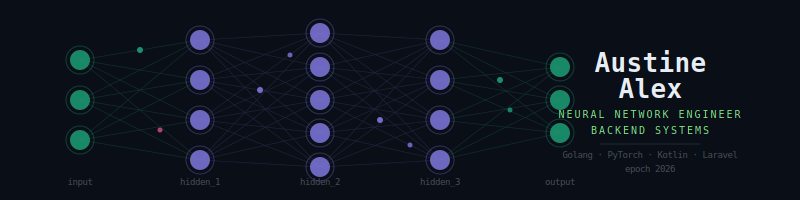

### 🧠 Stack

---

### 📡 Skill weights

| Layer | Weight |
|---|---|
| `backend_apis` | ████████████████████ 96% |
| `neural_networks` | ██████████████████░░ 88% |
| `mobile_kmp` | █████████████████░░░ 82% |
| `frontend` | ██████████████░░░░░░ 74% |
| `devops` | █████████████░░░░░░░ 65% |

---

---

### 🌍 Connect

---

<code>epoch 2026</code> — building scalable systems, one layer at a time

